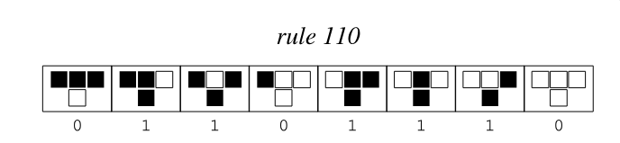

# Rust-Rule110
Author: Reece Wayt  
Contact: reecwayt@pdx.edu  
Date: 1/18/2025  
---
## Algorithm Description
A simple rust application for assignment 1 of CS 523.

Rule 110 is a elementary cellular automata which means each cell is binary 0 or 1. Each generation of a string of binary is created iteratively by cycling through individual cells, considering each cells neighboring cells (i.e left and right) to determine what the next cell value will be in the next generation. Its important to note that in the case of 8-bits, where each bit is a cell, the 7th bit's right neighbor wraps around to bit position 0; vis-avis the 0th bit's left neighbor wraps around which would be the 7th bit. There are many rule sets to chose from, but this implementation uses rule 110 as summarized pictorally below.  

    
  *Image source: [Wolfram MathWorld - Rule 110](https://mathworld.wolfram.com/Rule110.html)*

Here I'm using **u8** method for encapsulating generational data. Another method could use an array instead. 

## Building and running the application
```bash
cargo run
```